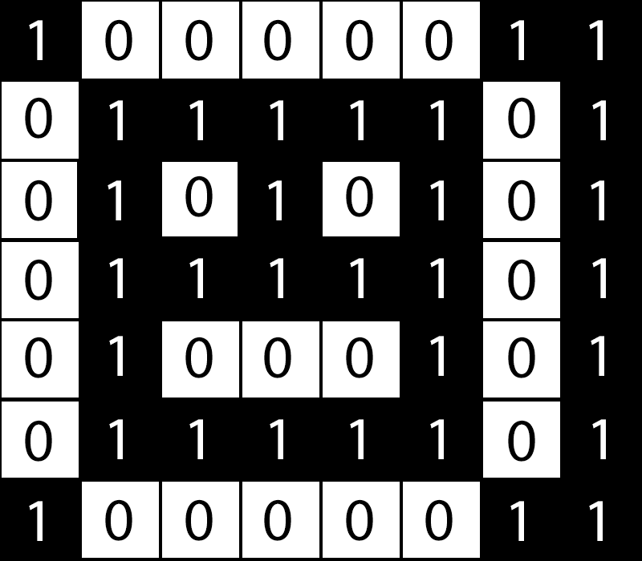

## Uloha 3

### Zadání

V schéme je zakódovaný obrázok. Vyhodnoťte použitý kód, diskutujte o možnom vzhľade obrázka,
jeho farbách, veľkosti. Schéma:

```
10000011
01111101
01010101
01111101
01000101
01111101
10000011
```

### Postup

- Víme, že zadaný binární kód je obrázek
- Víme, že zadaný binární kód je relativně krátký, proto zřejmě obsahuje 1-bitový obrázek
- 1-bitový obrázek je takový obrázek, který má dvě možné barvy (0 = bílá, 1 = černá). Analogicky k tomu, třeba 2-bitový obrázek by měl 4 možné barvy (00, 01, 10, 11), 3-bitový by měl 8 barev atd.
- Každé číslo v bitové reprezentaci obrázku tedy převedeme na černý nebo bílý pixel, podle toho, jestli je na jeho pozici 1 nebo 0

### Řešení



### Pro diskuzi o velikosti a barvách

Pokud by zadaný kód reprezentoval třeba dvoubitový obrázek (což by mohl, to by všechno záleželo na metadatech obrázku, kde tato informace má být uložena). 